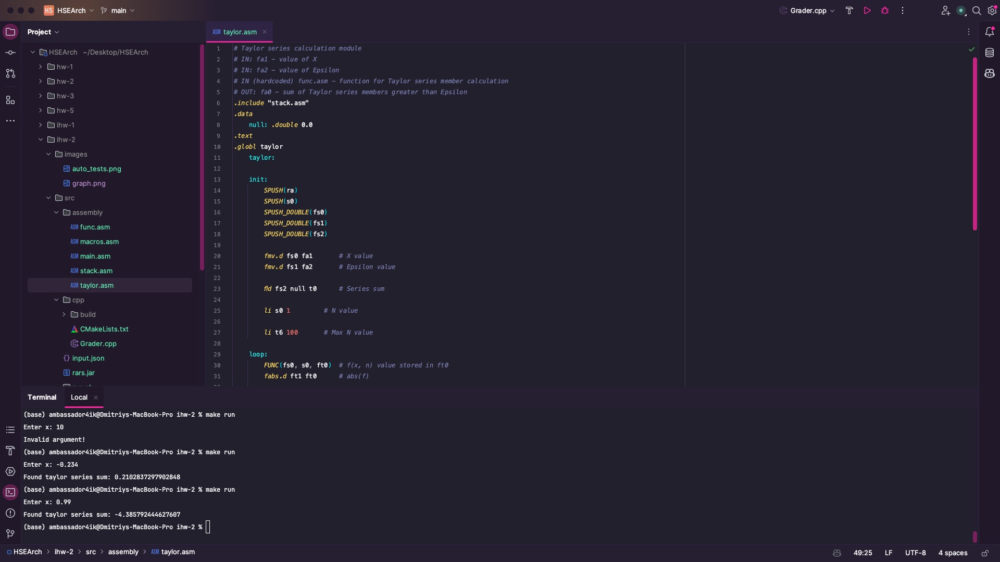
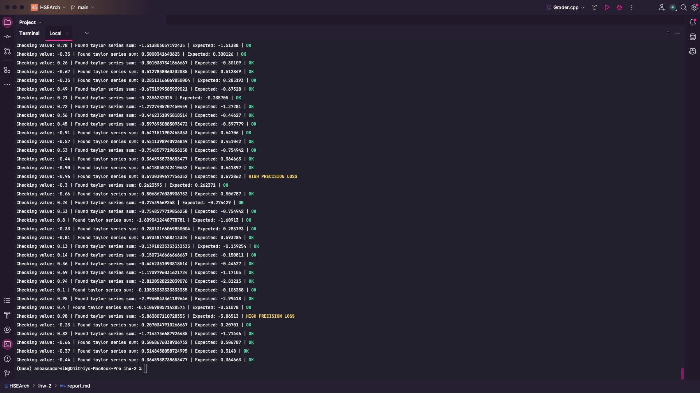
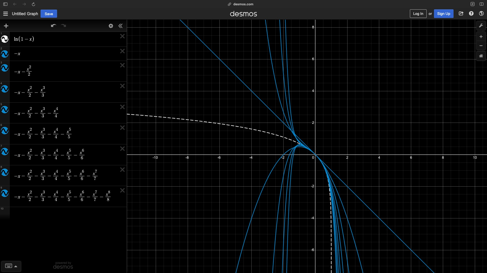

# ИДЗ #2
## Целочисленная арифметика. Одномерные массивы

### Задание
**Вариант 17.** Разработать программу, вычисляющую с помощью степенного ряда с точностью не хуже 0.1% значение функции `ln(1 - x)` для входного параметра x.\
**Выполнил:** Игнатенко Дмитрий Александрович БПИ226\
Работа на 10 (очень надеюсь).

### Архитектура
В этот раз я не стал рисовать карту архитектуры, потому что она слишком простая. Есть два файла макросов, основная программа и две подпрограммы, а так же тестирующая система почти идентичная той, что была в прошлый раз.

### Ассемблер-код
Основной код программы находится в папке [assembly](src/assembly), основной файл - [main.asm](src/assembly/main.asm).\
Коротко про другие файлы:
#### [macros.asm](src/assembly/macros.asm)
Содержит макроопределения, используемые в программе.\
Вместе с представленными подпрограммами составляет автономную библиотеку, которую можно использовать в других программах.
#### [stack.asm](src/assembly/stack.asm)
Макросы для работы со стеком.\
Продублированы отдельно от [macros.asm](src/assembly/macros.asm) для удобства использования в других подпрограммах и избежания множественного включения. По этой же причине туда добавлен макрос вызова функции `func.asm`.
#### [func.asm](src/assembly/func.asm)
Содержит подпрограмму подсчета n-го члена степенного ряда.\
Принимает на вход `n` и `x`, возвращает `a_n = - x^n/n`. Вызывается из [taylor.asm](src/assembly/taylor.asm).
#### [taylor.asm](src/assembly/taylor.asm) 
Содержит подпрограмму вычисления суммы ряда Тейлора до указанной точности.\
Принимает на вход `x` и `eps`, возвращает сумму ряда с указанной точностью (ну почти, про точность читайте где-то пониже). Вызывается из [main.asm](src/assembly/main.asm).

#### Немного обо всем
Подпрограммы используют локальные переменные и сохраняют значения `s`-регистров на стеке. Для возврата значений используется регистр `a0` (`fa0`), для передачи параметров - регистры `a1-a2` (`fa1-fa2`).\
Передача параметров описана непосредственно в подпрограммах, потому что это логичнее, чем писать их в макросах или у вызовов макросов.
### Ручные тесты
Благодаря поддержке эмулятором RARS работы в console-only режиме, можно запускать программу без GUI. Для этого выполните следующую команду:
```shell
make run
```
Если у вас не установлен `make`, вы можете запустить программу напрямую:
```shell
java -jar ./src/rars.jar sm nc p ./src/assembly/main.asm
```
При возникновении ошибок, убедитесь, что вы находитесь в корневой папке проекта.\
Пример работы программы с ручным вводом:



Программу так же можно запустить в Docker-контейнере, для этого выполните команду:
```shell
make run-docker
```
При возникновении ошибок, убедитесь, что у вас установлен `docker` и `docker-compose`.\
Если у вас отсутствует `make`, команды для запуска вы можете найти в [Makefile](Makefile).

Программа все так же будет работать, если просто запустить ее в эмуляторе RARS, если конечно вам угодно вручную поочередно открывать 5 файлов...

### Автоматические тесты
Для автоматизации тестирования была написана программа на `С++`.\
Программа и библиотеки к ней находятся в папке [cpp](src/cpp).\
В данной версии тесты генерируются автоматически из диапазона (-1, 1). Некорректные входные данные не проверяются (потому что оно точно работает, проверено вручную, да и это неинтересно смотреть на `Invalid argument!`).\
Для запуска автоматического тестирования используйте следующую команду:
```shell
make test
```

Рекомендуется использовать Docker-контейнер, так как в нем программа гарантированно работает.\
Для запуска автоматического тестирования в Docker-контейнере используйте следующую команду:
```shell
make test-docker
```

Пример работы программы с автоматическим вводом:



### Философские рассуждения о точности, рядах Тейлора, функциях и вычислении экспоненты
Посчитать сумму степенного ряда вида `-x^n / n` на отрезке `[0, 1)` кажется несложной задачей, но что делать если ассемблер-то ~~фальшивый~~ в эмуляторе (то есть медленный)? Можно заметить, что для значений, близких к единице, нам придется выполнить вычисление очень большого количества членов ряда чтобы достичь желаемой точности - например, даже для значения `x = 0.999` при `epsilon = 0.001` нам потребуется отыскать порядка сотни членов ряда, то есть 100 раз вызвать функцию экспоненты, которая работает 'в лоб' - просто перемножает `x` сам на себя `n` раз. Тогда всего потребуется `1 + 2 + .. + 100 = n(n - 1) / 2` умножений. За квадрат! Не так плохо, казалось бы, но опытным путем установлено, что RARS с этим не справляется - выполнение слишком долгое. 

Но что такое отрезок `[0, 1)`? Лишь малая часть! Что будет на отрезке (ого!) `[-1, 0)`? Да то же самое, только еще хуже - теперь ряд знакочередующийся (фу!). Мы имеем ту же самую проблему - при значениях, близких к -1, нужно считать даже больше членов ряда, поскольку мало того, что члены ряда очень медленно убывают при `x -> -1`, так они еще и меняют знак! ~~Отвратительно!~~

Вы думали, что это все? Никак нет! Очевидно, рассматривать `[1, +inf)` мы не будем, так как `ln(1 - x)` не определена на этом отрезке. Рассмотрим же `(-inf, -1)`. Чего плохого в этом отрезке? Все просто - он находится вне области сходимости нашего степенного ряда! Для нас это означает только одно - придется искать еще и еще больше членов этого самого ряда, а столько времени у нас, очевидно, нет, потому что на данном отрезке ряд знакочередуется.

**Итак, для чего все эти рассуждения?** Собственно для того, чтобы внести следующие изменения в программу:
1. Максимальная глубина (номер члена) ряда Тейлора установлена на уровне 100, на практике эта цифра оказалась оптимальной по времени. Да, таким образом мы теряем в точности, но зато избавляемся от долгих зависаний. 
2. Область допустимых значений сужена до области сходимости степенного ряда, т.е. `[-1, 1)`. Практика показывает, что результаты для меньших значений сильно отличаются от реальных для функции. Тем не менее, программа работает и с ними - достаточно будет убрать проверку в файле макросов [macros.asm](src/assembly/macros.asm). 
3. Тесты, для которых `abs(x) > 0.9` и для них разность ожидаемого значения и полученного больше `epsilon`, считаются частично пройденными (HIGH PRECISION LOSS), по причинам, указанным выше.

На приведенном ниже графике видно, почему так происходит:



Действительно, лишь на отрезке `[-1, 1)` функции достаточно близки к `ln(1 - x)`.

### Примечания
* Работа программы была проверена только на Mac OS 14 и Ubuntu 22.04, при использовании не-Unix систем рекомендуется использовать Docker, поскольку программа использует `shell`. В теории, все должно заводится и на Windows, но возможности проверить у меня не было.
* Для очистки проекта используйте команду `make clean`.
* У меня не получилось толком разбить отчет на разные количества баллов, тут слишком много всего оказалось...
* Методы обработки и хранения чисел с плавающей точкой в RARS и C++ немного отличаются, поэтому результаты не идентичны при (вроде бы) похожем методе вычисления. 
